Lovely Composer Docs (ラブリーコンポーザ 公式説明書) - ver.1.2.0 
#################################################################

概要
==============================================================================
これは個人開発の音楽ソフト Lovely Composer(ラブリーコンポーザ) の公式説明書です。

ラブリーコンポーザ（愛称: ラビコン）は、8bitゲーム機風の音楽や効果音を手軽に楽しく作れることを目指したツールです。

説明書の内容は大きく分けて

* 機能説明 
* `チュートリアル（入門編） <tutorial.rst>`_ 

に分かれています。

内容が最新版とは異なる場合があると思いますが、そのときは適当に読み替えてください。

このソフトは音楽ソフトですが、ゲーム『`ダンジョンウィッチーズ - 少女の帰宅 - <https://1oogames.booth.pm/items/2263636>`_』の続編ともなっていて、そのキャラクターなども登場します。

サポート・バグ報告や要望の受付等は

* 各種DL販売サイト
 
  * BOOTH - https://1oogames.booth.pm/items/3006558
  * itch.io https://1oogames.itch.io/lovely-composer
  * DLsite https://www.dlsite.com/home/work/=/product_id/RJ331224.html

* 公式twitterアカウント https://twitter.com/1oo_games
* 公式Discord https://discord.gg/96GhPwjQnE

で行っています。

もくじ
===============================================================================

.. contents::

ストーリー
==============================================================================

とある森の中…… 小さな家に魔女たちがひっそりと暮らしていました。

魔女たちは外の人間に見つかってはいけない存在でした。
村人のトーマスが届けてくれる、おいしい食べ物だけが頼りです。

ところがある日、トーマスはとつぜん豹変し、
食べ物を持ってこないばかりか家を乱暴にたたくようになります。

なんと彼は『グリズリア聖歌隊』の"聖歌"によって、
魔女を倒すように洗脳されてしまったのです。

家は頑丈なので心配ありませんが、このままではご飯が食べられません。

魔女たちは魔法の楽器「ラブリーコンポーザ」を使って、
音楽の力でトーマスを改心させて、食料と生活を取り戻すことにしました!

作曲画面の概要
==============================================================================

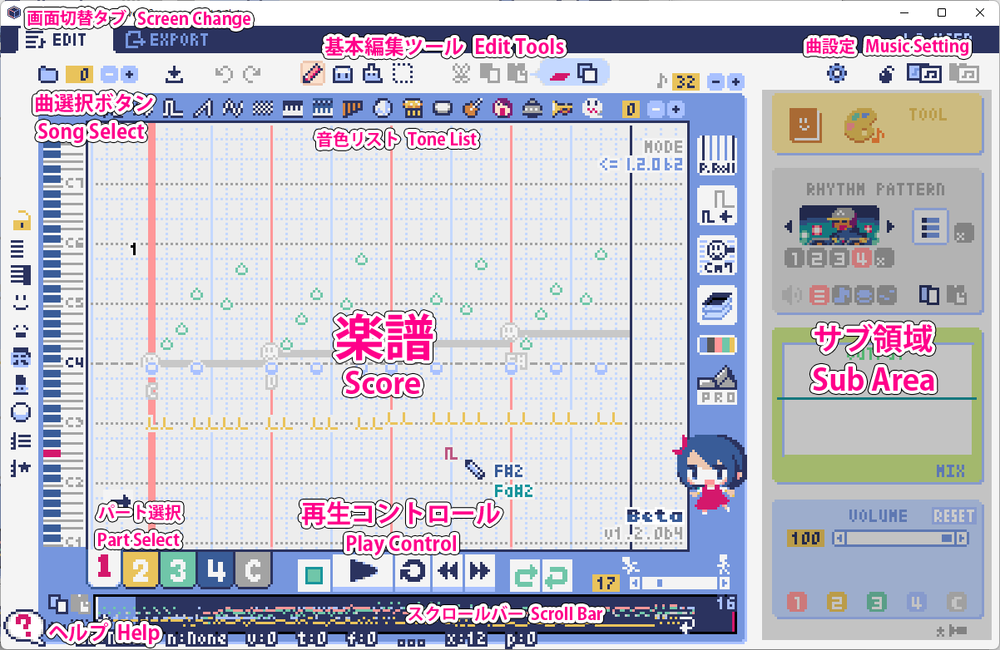

基本的な画面レイアウトは上の画像のようになります。
それぞれの部分については後で説明します。

  * 画面左下の？マークが赤い時は、吹き出し式のヘルプがマウスカーソル横に表示されます。
  * マウスカーソルのある部分の説明テキストが、画面下部に表示されます。（吹き出しでの表示より多少詳しいです。）

楽譜（ピアノロール）
========================================================================

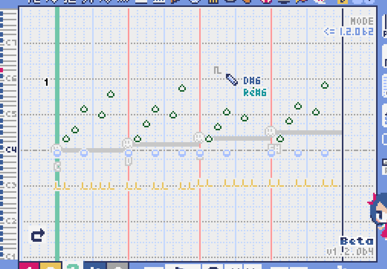

作曲時に一番中心となる編集画面で、ここで音符などを入力・編集することで曲を作っていきます。

ピアノロールと呼ばれる表示形式で、音楽の五線譜と同じように、縦軸は音程で、小節が縦線で区切られています。（五線譜風の表示にも変更可能です。）

左上の数字は現在のページ番号です。ページ移動は早送りボタンや巻き戻しボタン、ページスクロールバーでします。

補助的に、ループ位置やミュート状態等の表示もされます。互換再生モード時はどのバージョン互換かが右上に表示されます。

* 音色アイコンが各パートの色で表示されます。デフォルトでは小さいアイコンで表示されます。
* C4という文字の横に水平点線が表示されている位置の音程が「真ん中のド」となります。
* デフォルトでは選択中のパートの音色は濃く、それ以外のパートの音は薄く表示されます。
* 通常パートとコードパートでは少し役割が違います。

通常パート
-----------------------------------------------------------------------------------

パート選択ボタンで 1 / 2 / 3 / 4 のいずれかを選択すると、選択したパートへの音符の入力・編集ができます。

コードパート
-----------------------------------------------------------------------------------

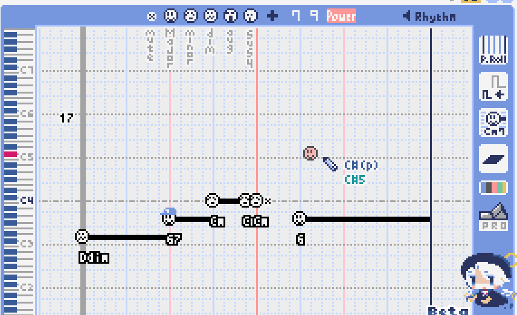

パート選択部分で C を選択すると、コード入力ができます。 (C はコード=Chordの頭文字です)

基本コードの選択は楽譜の上側に表示される顔アイコンで、追加音はその右にあるボタンで設定します。

追加音は帽子、パワーコードは顔色でアイコン表示されます。

コードは一か所で指定すると、次のコードが現れるまで、引き続き同じコードの音を再生するようになっています。（黒い線が自動的に伸びていきます）

途中で止めたい場合はミュート（×マーク）を止めたい位置に指定してください。

右クリックでコードの試聴ができます。上部で "Rhythm" を表示中は、現在のページで選択しているリズムパターンでの再生、 Tone のときは矩形波のみでの再生となります。コードの音程は太い線で、コードの各構成音（ドミソなど）は細い線で表示されます。

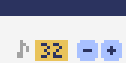

楽譜の右上の数字はページあたりの最大音符数を表しています。

* +ボタンを押すと1ずつ増やして最大32まで設定することができます。
* -ボタンを押すと1ずつ減らして最小1に設定できます。

楽譜上にも最大音符数が縦線で位置表示されます。再生位置バーがこの縦線を越えると次のページに移動します。

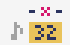

曲設定で「ページごとに設定」にした場合、リンク切れアイコンが表示され、ページごとの音符数をひとつひとつ個別に設定できます。

表示オプション
-------------------------------------------------------------------------------------

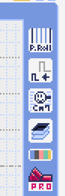

楽譜の右側のボタンで、楽譜の表示設定を変更することができます。上から

* ピアノロール表示 / 五線譜風表示の切り替え
* 音符のアイコンサイズ変更
* コード名の表示、およびリズムパターンで実際に鳴らされる音の音符表示のオン/オフ
* パートのレイヤー表示方法の切り替え（レイヤー透過表示、全レイヤー通常表示、選択レイヤーのみ表示）
* 背景カラー設定　下の画像のウィンドウで色や画面全体のパレットカラーを指定します。
* Proモード切り替え

  五線譜風表示はあくまでもピアノロールベースなので、線が等間隔でなかったりして、おそらく一般の五線譜として正しいものではありません。

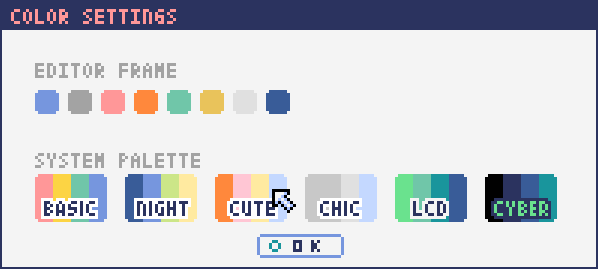

Proモード
------------------------------------------------------------------------------------

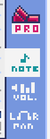

画像の一番上のPROスイッチをON（赤い状態）にすると、画面の一部が切り替わり、さまざまなボタンや上級者向け機能が表示されるようになります。

Proモードでは、上画像のボタンで、音符入力、ボリューム入力、パン入力を切り替えてそれぞれ楽譜上で入力することになります。

ボリューム入力（Proモード時のみ）
------------------------------------------------------------------------------------

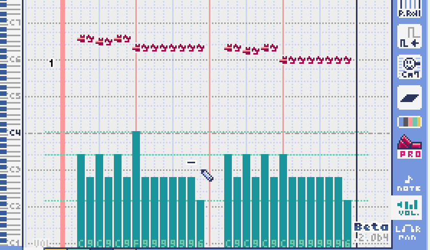

Proモードでボリューム入力タブを選択すると、楽譜の下部でボリューム指定ができるようになります。

指定できる音量の値は0～15の16段階になります。（これは8bitゲーム機を想定した仕様です。）

音量のデフォルト値は12(C)で、0は完全な無音です。

音量は棒の高さのほかに、最下部の数字（16進数）で表示されます。

  * 16進数では A=10, B=11, C=12, D=13, E=14, F=15 を表します。
  * 1段階は均一に2dBとなっていて、+6dB～-22dBの範囲で指定できます。

※なお、通常の音符入力タブでも、Altキーを押しながらペンツールで描くことでボリューム値を入力することができます。

パン入力（Proモード時のみ）
------------------------------------------------------------------------------------

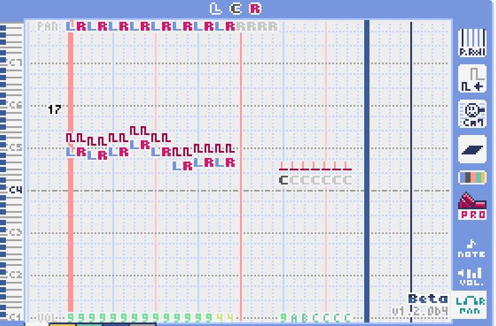

Proモードでパン入力タブを選択すると、音を中央 / 左 / 右 のどこから出すか（パン）を音符単位で指定できます。

Cが中央、Lが左、Rが右となっています。

パンは一か所指定すると以後の音符にも引き継がれます。

マウスホイールの上下で現在選択中のパンを変更できます。

曲の選択
========================================================================

数字は現在開いている曲番号を表しています。

+ボタンを押すと次の曲、-ボタンを押すと前の曲を開くことができます。

曲番号は0～31番まで選べます。（※将来的に増える予定です）

左端のフォルダアイコンを押すとフォルダ選択ができます。ユーザ用フォルダ（LC_USER）やサンプル曲用フォルダ（LC_SAMPLE）が最初から用意されています。

サンプル曲用フォルダを開いているとき等は、下画像のように数字が赤く表示され、ファイル保存ができません。

  書き込み禁止の状態で曲を作ってしまった場合は、曲コピー機能を使って別番号へコピーしてください。

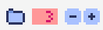

フォルダ選択画面は以下のようになっています。

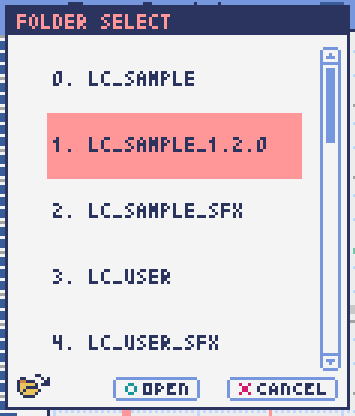

フォルダ名を選択してOPENを押すと、フォルダを開くことができます。

左下のフォルダオープンアイコンを押すと、曲データが格納されている実際のフォルダがOS側のエクスプローラ等で開かれます。

基本機能
============================================================================

左から順に

* 曲のファイル保存
* アンドゥ（元に戻す）
* リドゥ（やり直し）

ラビコンはオートセーブ式となっていて、曲移動時やアプリの終了時に曲データが自動的にファイルに保存されるようになっています。

そのため、ファイル保存ボタンを押す必要は必ずしもありませんが、ボタンを押した場合はその場で曲データがファイルに書き込まれますので、アプリの異常終了などの万一の事態のために押しておいた方が安心かもしれません。

  実際の曲データは、LovelyComposerのフォルダ / music / 選択フォルダ / 曲番号.jsonlファイルに保存されます。

基本編集ツール
============================================================================

.. image:: img/basic_edit_tool.png

左から順に

* ペン
* 消しゴム
* ブラシ
* 範囲選択

* 切り取り
* コピー
* ペースト
* 範囲選択の操作対象レイヤー指定（選択中のパートのみ / 全パート）
* 範囲選択の透過コピー指定（通常コピー / 透過コピー）

ペン
-----------------------------

楽譜上で左クリックで音符の入力、右クリックで選択中の音色の試聴ができます。音符の上で右クリックするとその音色を選択（スポイト）することができます。

Shiftキーを押している間は、カーソルを水平移動に固定できます。

  Proモードのボリューム入力では、音量を指定できます。パン編集では音の左右を指定できます。

消しゴム
-----------------------------

楽譜上で左クリック、ドラッグで音符の削除ができます。

  Proモードの音量編集では、音量指定の削除またはデフォルト値に戻します。またパン編集では、パン指定を削除します。

ブラシ
-----------------------------

楽譜上で左クリックで現在開いているページの音符の音色を、すべて他の音色に変えることができます。音符の上でクリックすると同じ音色の音だけを塗り替えます。ドラッグ操作でなぞった音符のみ塗ることもできます。

  Proモードの音量編集では、一括音量指定になります。またパン編集では、既存のパン指定の部分を塗りつぶします。

選択範囲
-----------------------------

楽譜上の音符を選択します。選択後に選択範囲を左右ドラッグで移動、Alt+ドラッグでコピー、Deleteキーで削除します。また上下ドラッグで音程を変えられます。（トランスポーズ）

  Proモードの音量・パン編集でも動作は今のところ同じです。

再生コントロール
========================================================================

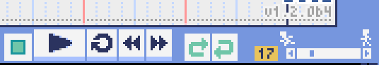

曲の再生に関するボタンがまとめられています。

* 再生ボタン（大きな三角）を押すと曲を再生します。
* 停止ボタン（四角）を押すと再生を停止します。停止中に停止ボタンを押すと、曲の先頭に戻ります。
* 1ページリピートボタン（円形の矢印）を押し、緑色にすると、現在開いているページのみでループ再生されるようになります。（この設定は曲ごとに保存されない、一時的な再生設定です。）
* 早送りボタンを押すと、次のページに移動します。
* 巻き戻しボタンを押すと、前のページに移動します。
* ループ始端ボタン（左側）を押し緑色にすると、ループ時の戻り先を現在のページに設定します。緑（オン）の状態でもう一度押すと、灰色（オフ）になり設定が解除されます。
* ループ終端ボタン（右側）を押し緑色にすると、ループ再生の最後の部分を現在のページに設定します。あとは同様です。
* 一番右のテンポ設定スライダーでは、曲の再生速度が設定できます。数値が小さい（カーソルが左に近づく）ほど速度が速くなります。

  

※曲設定でテンポが「ページごとに指定」となっている場合、下画像のようなリンク切れアイコンが数値の上に表示されます。この場合、テンポはページ単位でひとつずつ別々に設定することになります。

音色リスト
========================================================================

ペンツールなどで使用する音色を選択することができます。
+ボタンで次の音色一覧、-ボタンで前の音色一覧を表示します。数字は現在の音色一覧のページ番号です。

音色の種類には今のところ大きく分けて

* 鳴り続ける音色
* 鳴り続けない音色
* スラー音色（音程が滑らかにつながる）

があります。

  各音色は、実際には「基本波形 + エフェクト」でできています。その組み合わせは画面下部のヘルプガイドに表示されます。

  同じ基本波形の音色は、左右に並べることで音をつないだり、鳴り方をコントロールすることもできます。

曲の選択
============================================================================

吹き出しヘルプ表示ボタン
============================================================================

押すと吹き出しヘルプ表示をオン・オフを切り替えられます。

曲の設定
============================================================================

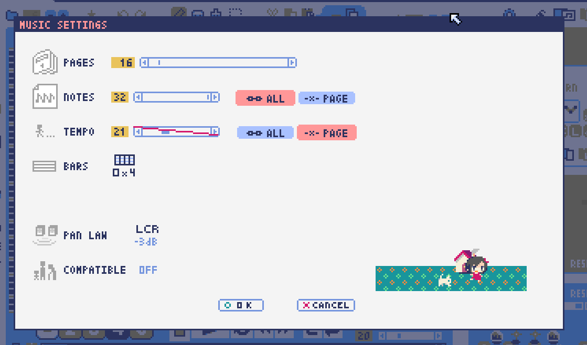

スケール機能
============================================================================

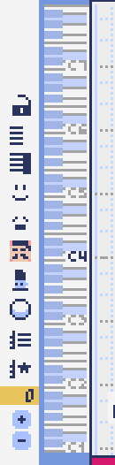

一定のルールで入力できる音程を制限して、特定の音階の曲を入力しやすくする機能です。入力できない音程が鍵盤上に表示されます。
また選択時にはそのスケールでドから順に１つずつ上がった音がプレビュー再生されます。

上から

* （ロック解除）
* メジャースケール
* マイナースケール
* 白鍵のみ
* 黒鍵のみ
* 琉球スケール
* 雅楽スケール
* ホールトーン（全音間隔 / 1音飛ばし）
* コード（コードで使用している音程のみ使える）
* マジカルスケール1（コードと不協和音になる音を除外します。アボイドロック。）

で、+と-ボタンでキーを上下できます。

また、下の2つのスケールは、コードパートに入力されているコードに応じて変わる特殊なスケールです。これらを選択した場合は、キーは変えられません。

Ctrlキーを押している間はスケール機能が無効になります。一時的にスケール外の音を入力したい場合に便利です。

ツールパネル
=============================================================================

別窓を開いて使うタイプの便利ツールの起動ボタンが表示されていて、押すとウィンドウが開きます。

左から

* コードパターンツール
* 音色パレットツール

となっています。

コードパターンツール
============================================================================

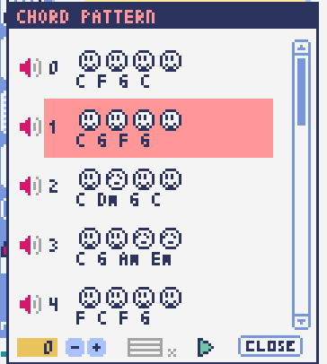

定番のコード進行を一覧から選んで入力できるツールです。コードの知識がなくても、実際に音を鳴らして聞きながら好きなコード進行を選べます。

コード一覧のどれかを左クリックすると、楽譜上に選択したコードパターンがセットされます。

左端のプレビュー再生ボタン（スピーカーアイコン）を押すと、右側のコードをプレビュー再生します。

スクロールバーの操作またはマウスホイールの上下で、一覧をスクロールすることができます。

ウィンドウの下部はオプション設定項目です。

再生ボタンが有効（緑）の場合、コードパターンのセットと同時に曲が再生されます。（現在のリズムパターンの音でのプレビューができます。）

左端の+や-ボタンで、入力するコードのキーを上下することができます。

真ん中は「ページごとのコード数指定ボタン」（CHORD NUM / PAGE）です。未指定（グレー）の場合は、曲設定の「ページごとの小節数」に応じます。

CLOSEボタンでウィンドウを閉じます。

音色パレットツール
========================================================================

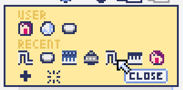

よく使う音色をまとめておける便利ツールです。

ユーザが自由に選んだ音色が上側、最近使った音色が下側に表示されます。
+ボタンを押すと現在選択している音色がパレットに追加されます。

音色アイコンの上で左クリックすると音色を選択でき、右クリックで削除ができます。
音色をすべて削除するにはクリアボタンを押します。ウィンドウを閉じるにはCLOSEボタンを押します。

通常パートを表示しているときは通常の音色パレット、コードパートの場合はコードパレットに切り替わります。

ダンサー
========================================================================

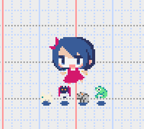

『ダンジョンウィッチーズ』のキャラクターたちが曲のテンポに合わせて歌って踊ったり、いろいろな演出をしたりしてくれます。
間接的にメトロノームのような役割も果たします。

左クリックで別アニメパターンに変更、ドラッグで移動、右クリックで拡大縮小します。

歌っている音程は選択中のパートの音符の音程です。

  曲のテンポとダンスの速度感があまりにも違う場合は、曲設定の『ページあたりの小節数設定』が実際の曲データと違っているかもしれません。

ボリュームパネル
========================================================================

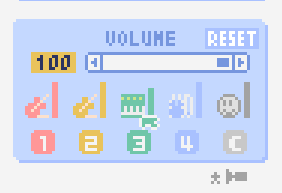

再生ボリューム変更、各パートのミュートやソロ再生が指定できます。（このパネルでの設定は、曲ごとには保存されません。）
また現在再生されている音色等もアイコン他で視覚的に表示されます。

パート番号の左クリックで各パートのミュート、右クリックでソロ再生が指定できます。
ミュートされているパートは、パート選択部や楽譜上にもアイコン表示されます。

RESETボタン（リセットボタン）ですべての設定を初期値に戻せます。

  * Proモードでは、視覚表示に音量や出力チャンネルの表示が加わります。また、音量スライダーを0にセットできるようになります。
  * 視覚表示には、曲データやミキサーでの指定値をかけあわせた最終的な結果（実際に鳴っている音と同じ）が表示されます。

ボリュームパネル右下のボタンは、動画などを撮影するときのための、グリーンバック撮影（クロマキー合成）用のおまけ機能で、ダンサー関連以外の背景要素を一色で塗りつぶします。

ミキサー風パネル
============================================================================

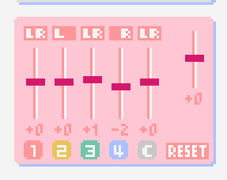

曲全体のパート別音量や出力チャンネルを一括で調整できます。Proモードでのみ表示されます。

中央の音量スライダーについては、楽譜上での音量指定の値を上下させます。左ドラッグのほか、マウスホイールの回転でも増減できます。音符ごとの音量は0～15(0～F)を超えた値にはなりませんので、常にスライダーで指定した数値通りに音量が変わるわけではありません。

最上部の出力チャンネルについては、表示されているチャンネルのみ音を出力します。左右クリックするとLR / L / Rを切り替えられます。

右上のスライダーは、全パートの音程を上下させます（トランスポーズ）。左ドラッグだと3くらいずつ変化してしまいますが、マウスホイールの回転で1ずつ増減できます。自分で作った曲やサンプル曲の試聴で音程を変えてみたりするのも面白いです。

パート番号ボタンを押すと、音量スライダーやチャンネル設定の有効/無効を切り替えられます。調整した結果の確認に使えます。

RESETボタン（リセットボタン）ですべての設定を初期値に戻せます。

  楽譜側のパン指定でL、ミキサー側の指定でRだった場合、出力される音は無音となります。その場合は、ボリューム表示パネルで薄いグレーアウト表示されます。

MIDI入力
============================================================================

ラビコンの音色を使って、MIDIキーボードで演奏することができます。

（音符入力、UI操作、録音などには対応していません。）

* 使用したいMIDI入力デバイスを環境設定ツールで選択できます。デフォルトで有効ですが、入力を無効にすることもできます。
* ver.1.2.0現在では、入力から発音までに多少の遅延があります。（60fpsで処理しているため）

エクスポート画面
==============================================================================

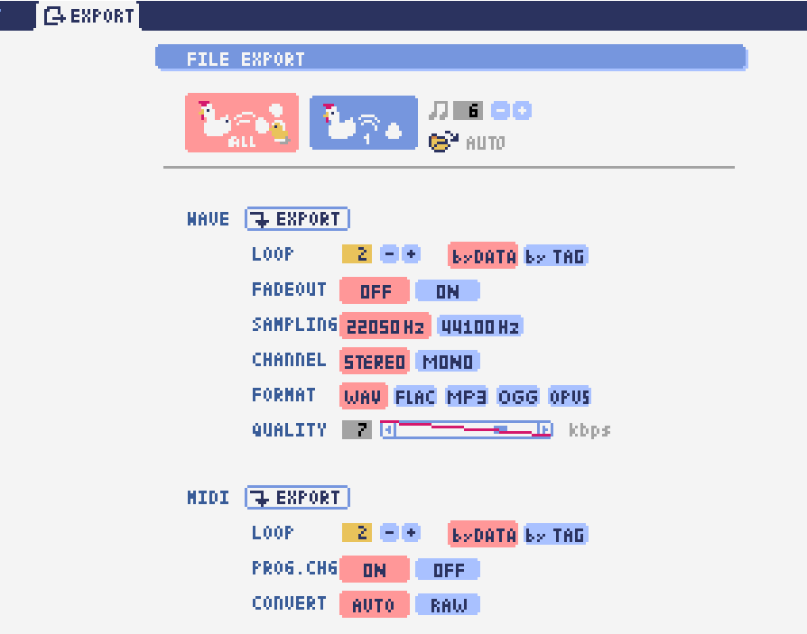

環境設定ツール
==========================================================================

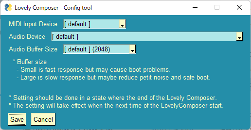

使用するMIDI/オーディオデバイスの選択や、オーディオバッファサイズの設定ができます。

設定はラビコンの起動時に有効になります（ラビコン起動中に設定した場合は、再起動まで反映されません。）

  オーディオバッファサイズは小さくした方が再生や一部表示のレスポンスが早くなりますが、小さくしすぎると音が再生できなくなったりブツブツとノイズが混ざったり、再生が不安定になる可能性があります。最適値はPC環境によって異なります。

Q&A
================================================

起動ができない …… セキュリティ警告が出た場合
--------------------------------------------------------------

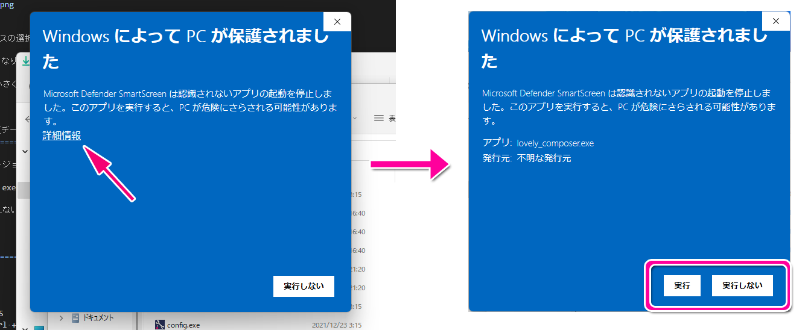

ラビコンをダウンロードした後に初めて起動する場合、上のような警告が表示され、「実行しない」のほかに「実行」ボタンが表示されない場合があります。この場合は矢印で示した場所にある「詳細情報」を押すと、「実行」ボタンが表示されるようになります。

ソフトのバージョンアップ（データ移行方法）
--------------------------------------------------------------

* 曲データの移行は、新しいバージョンの曲データフォルダに、今までのバージョンの曲データフォルダをコピーすることで行えます。曲データフォルダは、LovelyComposerフォルダ/music/ 以下にあります。（曲データファイルは、各フォルダ内に入っている " 曲番号.jsonl "" (00.jsonl等)  です。）

* 環境設定を移行したい場合は、exeファイルと同じ場所にある app_settings.json ファイルを新しいバージョンへコピーします。

  ※データコピーの方向を間違えないように気を付けてください! 間違って逆にすると今まで作った曲が失われてしまいます。念のため事前にバックアップを取っておくと安心です。（将来的に、バージョンをアップデートしやすくする予定はあります）

ショートカットキー
==============================================================

**一般的な操作**

* ファイルの保存 ... Ctrl + S
* アンドゥ (元に戻す) ... Ctrl + Z
* リドゥ (進む) ... Ctrl + Y
* コピー ... Ctrl + C
* カット ... Ctrl + X 
* ペースト ... Ctrl + V 
* すべて選択 ... Ctrl + A
* 選択解除 ... Esc
* 選択したものを削除 ... Delete
* アプリケーションの終了 ... F10

**作曲画面**

* 再生/停止 ... スペース
* 1ページループ設定 ... O (オー)
* 次のページに移動 ... →　または　Shift + X
* 前のページに移動 ... ←　または　Shift + Z
* パート選択 ... 1,2,3,4,5

* ツール切り替え

  * ペン ... Q
  * 消しゴム ... W
  * ブラシ ... E
  * 範囲選択 ... R

* コード選択

  * ミュート ... Shift + A
  * Major ... Shift + S
  * Minor ... Shift + D
  * Dim ... Shift + F
  * Aug ... Shift + G
  * SUS4 ... Shift + H
  * 7th ... Shift + C
  * 9th ... Shift + V
  * Power ... Shift + B

* 次の音色一覧 ... Ctrl + W
* 前の音色一覧 ... Ctrl + Q
* 次の曲を開く ... Ctrl + 2
* 前の曲を開く ... Ctrl + 1
* カーソルの平行移動 ... Shiftを押し続ける
* 音符入力タブでボリューム入力 ... Altを押し続けながらペンツール
* 選択範囲の複製 ... Altキーを押しながら選択範囲のドラッグ
* リズムパターン設定のコピー ... Alt + C
* リズムパターン設定のペースト ... Alt + V
* ソフトウェアキーボード
  
  * 演奏 ... Aの行, Zの行でピアノ鍵盤の並び
  * 1オクターブ上げる ... Page Up
  * 1オクターブ下げる ... Page Down
  * 臨時に1オクターブ上げる ... ↑を押し続ながら
  * 臨時に1オクターブ下げる ... ↓を押し続ながら

仕様
===================================================================

* パート数:  ユーザー 4パート + コード・リズムパターン　（音色は1音ごとに変更可能）
* 曲の長さ:  32音符 x 256ページ分　(最大1024小節)
* 音域:  C1 ～ B7　（MIDI基準、7オクターブ）
* 音色:  50パターン　(「基本波形 + エフェクト」の組み合わせで1つと数えた場合)
* 音量:  16段階　(1段階2dB、0は無音)
* ステレオ/パン:  中央 / 左 / 右 の切替え
* イントロ対応ループ機能
* Waveファイル出力機能
* MIDIファイル出力機能
* MIDIキーボード対応　（音の確認・簡易演奏用。データ入力や録音、UI操作等は不可）
* オートセーブ式

* Proモードで作成した曲は、ProモードがOFFの状態でも同じように再生されます。