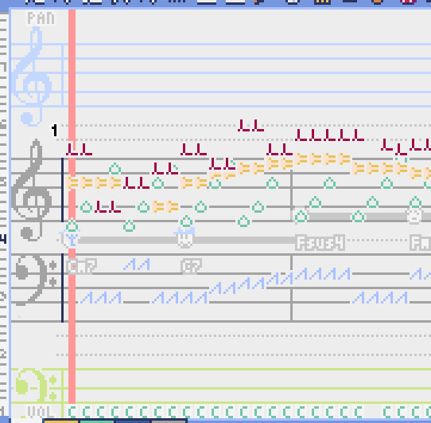

Lovely Composer Docs (ラブリーコンポーザ 公式説明書) - ver.1.2.0 
#################################################################

.. image:: img/header.png

概要
==============================================================================
これは個人開発の音楽ソフト『Lovely Composer(ラブリーコンポーザ)』の公式説明書です。

Lovely Composer（愛称: ラビコン）は、8bitゲーム機風の音楽や効果音を手軽に楽しく作れることを目指したツールです。

内容は大きく分けて

* 機能説明
* チュートリアル（入門編）

に分かれています。

内容が最新版とは多少異なる場合があると思いますが、そのときは適当に読み替えてください。

このソフトは音楽ソフトですが、ゲーム『`ダンジョンウィッチーズ - 少女の帰宅 - <https://1oogames.booth.pm/items/2263636>`_』の続編となっていて、そのキャラクターなども登場します。

サポート・バグ報告や要望の受付等は

* 各種DL販売サイト
 
  * BOOTH - https://1oogames.booth.pm/items/3006558
  * itch.io https://1oogames.itch.io/lovely-composer
  * DLsite https://www.dlsite.com/home/work/=/product_id/RJ331224.html

* 公式twitterアカウント https://twitter.com/1oo_games
* 公式Discord https://discord.gg/96GhPwjQnE

で行っています。

.. contents::

ストーリー
==============================================================================

とある森の中…… 小さな家に魔女たちがひっそりと暮らしていました。

魔女たちは外の人間に見つかってはいけない存在でした。
村人のトーマスが届けてくれる、おいしい食べ物だけが頼りです。

ところがある日、トーマスはとつぜん豹変し、
食べ物を持ってこないばかりか家を乱暴にたたくようになります。

なんと彼は『グリズリア聖歌隊』の"聖歌"によって、
魔女を倒すように洗脳されてしまったのです。

家は頑丈なので心配ありませんが、このままではご飯が食べられません。

魔女たちは魔法の楽器「ラブリーコンポーザ」を使って、
音楽の力でトーマスを改心させて、食料と生活を取り戻すことにしました!

編集画面の全体レイアウト
==============================================================================

.. image:: img/about_nonpro.png

基本的な画面レイアウトは上の画像のようになります。
それぞれの部分については後で説明します。

楽譜
-------------------------------------------------------------------------

.. image:: img/score_nonpro.png

作曲時にメインとなる編集画面で、音符データを編集することができます。

デフォルトでは選択中のパートの音色は濃く、それ以外のパートの音は薄く表示されます。

通常パートとコードパートでは少し動作が違います。

・ペンツール

左クリックで音符の入力、右クリックで選択中の音色の試聴ができます。音符の上で右クリックするとその音色を選択（スポイト）することができます。

・ブラシツール

左クリックで現在開いているページの音符の音色を、すべて他の音色に変えることができます。音符の上でクリックすると同じ音色の音だけを塗り替えます。ドラッグ操作でなぞった音符のみ塗ることもできます。

ループ位置やミュート状態等の表示もされます。

五線譜風ピアノロール表示

曲選択
---------------------------------------------------------------------------

.. image:: img/music_selector.png

数字は現在開いている曲番号を表しています。

+ボタンを押すと次の曲、-ボタンを押すと前の曲を開くことができます。

曲番号は0～31番まで選べます。（※将来的に増える予定です）

フォルダアイコンを押すとフォルダ選択ができます。ユーザ用フォルダ（LC_USER）やサンプル曲用フォルダ（LC_SAMPLE）が最初から用意されています。

サンプル曲用フォルダを開いているとき等は、下画像のように数字が赤く表示され、ファイル保存ができません。

  書き込み禁止の状態で曲を作ってしまった場合は、曲コピー機能を使って別番号へコピーしてください。

.. image:: img/music_selector_red.png

フォルダ選択画面は以下のようになっています。

.. image:: img/folder_select.png

フォルダ名を選択してOPENを押すと、フォルダを開くことができます。

左下のフォルダオープンアイコンを押すと、曲データが格納されている実際のフォルダがOS側のエクスプローラ等で開かれます。

再生コントロール
------------------------------------------------------------------------

.. image:: img/play_control.png

基本編集ツール
----------------------------------------------------------------------------

.. image:: img/basic_edit_tool.png

曲の選択
----------------------------------------------------------------------------

.. image:: img/music_selector.png

吹き出しヘルプ表示ボタン
----------------------------------------------------------------------------

.. image:: img/help_button.png

押すと吹き出しヘルプ表示をオン・オフを切り替えられます。

曲の設定
----------------------------------------------------------------------------

.. image:: img/music_settings.png

コード進行パターンツール
----------------------------------------------------------------------------

.. image:: img/chord_pattern_tool.png

定番のコード進行パターンを手軽に入力できるツールです。

音色パレットツール
---------------------------------------------------------------------------

.. image:: img/tone_palette.png

エクスポート画面
==============================================================================

.. image:: img/export_mode.png

ショートカットキー
==============================================================

一般的な操作

* ファイルの保存 ... Ctrl + S
* アンドゥ (元に戻す) ... Ctrl + Z
* リドゥ (進む) ... Ctrl + Y
* コピー ... Ctrl + C
* カット ... Ctrl + X 
* ペースト ... Ctrl + V 
* すべて選択 ... Ctrl + A
* 選択解除 ... Esc
* 選択したものを削除 ... Delete
* アプリケーションの終了 ... F10

曲エディット画面

* 再生/停止 ... スペース
* 1ページループ設定 ... O (オー)
* 次のページに移動 ... →　または　Shift + X
* 前のページに移動 ... ←　または　Shift + Z
* パート選択 ... 1,2,3,4,5

* ツール切り替え

  * ペン ... Q
  * 消しゴム ... W
  * ブラシ ... E
  * 範囲選択 ... R

* コード選択

  * ミュート ... Shift + A
  * Major ... Shift + S
  * Minor ... Shift + D
  * Dim ... Shift + F
  * Aug ... Shift + G
  * SUS4 ... Shift + H
  * 7th ... Shift + C
  * 9th ... Shift + V
  * Power ... Shift + B

* 次の音色一覧 ... Ctrl + W
* 前の音色一覧 ... Ctrl + Q
* 次の曲を開く ... Ctrl + 2
* 前の曲を開く ... Ctrl + 1
* カーソルの平行移動 ... Shiftを押し続ける
* 選択範囲の複製 ... Altキーを押しながら選択範囲のドラッグ
* リズムパターン設定のコピー ... Alt + C
* リズムパターン設定のペースト ... Alt + V
* ソフトウェアキーボード
  
  * 演奏 ... Aの行, Zの行でピアノ鍵盤の並び
  * 1オクターブ上げる ... Page Up
  * 1オクターブ下げる ... Page Down
  * 臨時に1オクターブ上げる ... ↑を押し続ながら
  * 臨時に1オクターブ下げる ... ↓を押し続ながら

