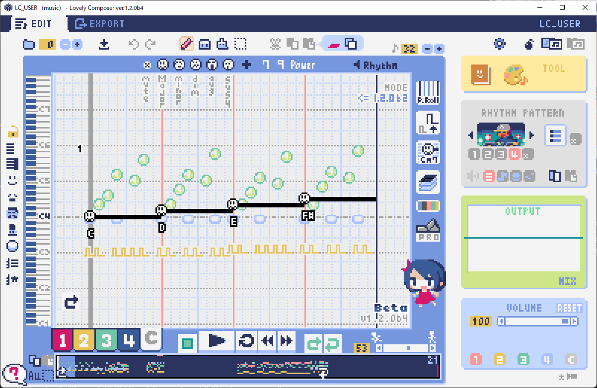

Lovely Composer Docs (ラブリーコンポーザ 公式説明書) - ver.1.2.0 
#################################################################

概要
==============================================================================
これは個人開発の音楽ソフト『Lovely Composer(ラブリーコンポーザ)』の公式説明書です。

Lovely Composer（愛称: ラビコン）は、8bitゲーム機風の音楽や効果音を手軽に楽しく作れることを目指したツールです。

説明書の内容は大きく分けて

* 機能説明
* チュートリアル（入門編）

に分かれています。

このソフトは音楽ソフトですが、ゲーム『`ダンジョンウィッチーズ - 少女の帰宅 - <https://1oogames.booth.pm/items/2263636>`_』の続編となっていて、そのキャラクターなども登場します。

サポート・バグ報告や要望の受付等は

* 各種DL販売サイト
 
  * BOOTH - https://1oogames.booth.pm/items/3006558
  * itch.io https://1oogames.itch.io/lovely-composer
  * DLsite https://www.dlsite.com/home/work/=/product_id/RJ331224.html

* 公式twitterアカウント https://twitter.com/1oo_games
* 公式Discord https://discord.gg/96GhPwjQnE

で行っています。

.. contents::

* 概要
* ストーリー
* 各画面説明
* チュートリアル
* よくある質問
* 基本仕様

ストーリー
==============================================================================
とある森の中…… 小さな家に魔女たちがひっそりと暮らしていました。

魔女たちは外の人間に見つかってはいけない存在でした。
村人のトーマスが届けてくれる、おいしい食べ物だけが頼りです。

ところがある日、トーマスはとつぜん豹変し、
食べ物を持ってこないばかりか家を乱暴にたたくようになります。

なんと彼は『グリズリア聖歌隊』の"聖歌"によって、
魔女を倒すように洗脳されてしまったのです。

家は頑丈なので心配ありませんが、このままではご飯が食べられません。

魔女たちは魔法の楽器「ラブリーコンポーザ」を使って、
音楽の力でトーマスを改心させて、食料と生活を取り戻すことにしました!

画面の基本レイアウト
==============================================================================

.. image:: img/about_nonpro.png

基本的な画面レイアウトは上の画像のようになります。
各部については後で個別に説明します。

エディット画面
==============================================================================

曲設定ウィンドウ
----------------------------------------------------------------------------

コード進行ツール
----------------------------------------------------------------------------

音色パレットツール
----------------------------------------------------------------------------

ショートカットキー
----------------------------------------------------------------------------

一般的なショートカット

* ファイルの保存 ... Ctrl + S
* アンドゥ (元に戻す) ... Ctrl + Z
* リドゥ (進む) ... Ctrl + Y
* コピー ... Ctrl + C
* カット ... Ctrl + X 
* ペースト ... Ctrl + V 
* すべて選択 ... Ctrl + A
* 選択解除 ... Esc
* 選択したものを削除 ... Delete
* アプリケーションの終了 ... F10

曲エディット画面

* 再生/停止 ... スペース
* 1ページループ設定 ... O (オー)
* 次のページに移動 ... →　または　Shift + X
* 前のページに移動 ... ←　または　Shift + Z
* パート選択 ... 1,2,3,4,5

* ツール切り替え

  * ペン ... Q
  * 消しゴム ... W
  * ブラシ ... E
  * 範囲選択 ... R

* コード選択

  * ミュート ... Shift + A
  * Major ... Shift + S
  * Minor ... Shift + D
  * Dim ... Shift + F
  * Aug ... Shift + G
  * SUS4 ... Shift + H
  * 7th ... Shift + C
  * 9th ... Shift + V
  * Power ... Shift + B

* 次の音色一覧 ... Ctrl + W
* 前の音色一覧 ... Ctrl + Q
* 次の曲を開く ... Ctrl + 2
* 前の曲を開く ... Ctrl + 1
* カーソルの平行移動 ... Shiftを押し続ける
* 選択範囲の複製 ... Altキーを押しながら選択範囲のドラッグ
* リズムパターン設定のコピー ... Alt + C
* リズムパターン設定のペースト ... Alt + V
* ソフトウェアキーボード
  
  * 演奏 ... Aの行, Zの行でピアノ鍵盤の並び
  * 1オクターブ上げる ... Page Up
  * 1オクターブ下げる ... Page Down
  * 臨時に1オクターブ上げる ... ↑を押し続ながら
  * 臨時に1オクターブ下げる ... ↓を押し続ながら

エクスポート画面
==============================================================================

全体ショートカットキー
----------------------------------------------------------------------------