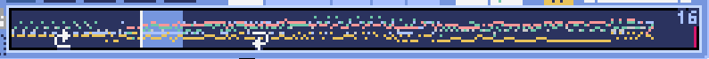
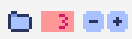
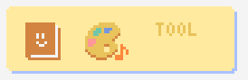
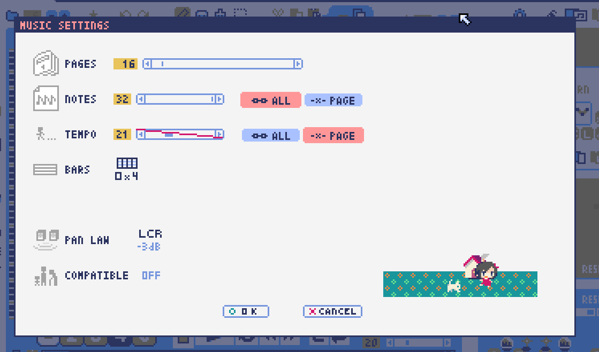
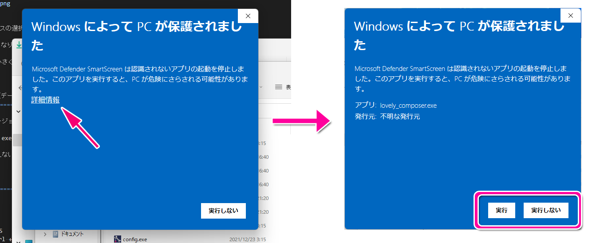

Lovely Composer Docs (Official Manual) - ver.1.2.0 
#################################################################

.. image:: img/lc_xmas2021_web_x4.png

Overview
==============================================================================
This is the official manual for the personally developed music software Lovely Composer.

Lovely composer is a tool that aims to make music and sound effects like 8-bit game consoles easy and fun.

The content may differ from the latest version, but in that case, please read as appropriate.

This software is a music software, but it is also a sequel to the game `Dungeon Witches - Girls Back Home - <https://1oogames.itch.io/dungeon-witches>`_, and its characters will also appear.

Support, bug reports and requests are accepted at the following.

* Marketplace 
 
  * itch.io https://1oogames.itch.io/lovely-composer

* Official twitter account https://twitter.com/1oo_games
* Official Discord https://discord.gg/96GhPwjQnE

Table of contents
===============================================================================

.. contents::

Story
==============================================================================

In a certain forest ... Witches lived quietly in a small house.

The witches should not be found by outsiders. Only the delicious food delivered by the villager Thomas is relied on.

But one day Thomas suddenly changed. Not only he don't bringing food, but also beating witch's house strongly.

He was brainwashed to defeat witches by the "Chant" of the "Grizzlia Choir"!

The house is protected by magic, so it's okay, but the witches will soon be unable to eat food.

So, the witches decided to use the magical instrument "Lovely Composer" to bring Thomas back with the power of music, to regain food and life!

Overview of music editor
==============================================================================

.. image:: img/about_nonpro_en.png

The basic screen layout looks like the image above.
Each part will be explained later.

  * When the question mark is red at the bottom left of the screen, balloon help is displayed neighbour to the mouse cursor.
  * A text description of the area where the mouse cursor is located is displayed at the bottom of the screen. (It is a more detailed than the display in the balloon.)

Play control
========================================================================

.. image:: img/play_control.png

At the bottom of the screen, there are buttons for playing songs. The functions are as follows in order from left to right.

* **Stop** ... Stops playing the music. If you press the stop button while stopped, you will return to the beginning of the music. (You can also stop by pressing the space key during playback.)
* **Play** ... Plays the music. (You can also play by pressing the space key while stopped.)
* **1 page repeat** (circular arrow) ... Press the button to make it green so that loop playback is performed only on the currently open page. (This setting is a temporary playback setting that is not saved for each song.)
* **Fast forward**  ... Moves to the next page.
* **Rewind**  ... Moves to the previous page.
* **Loop start** (Left side) ... Press the button to turn green to set the return destination when looping to the current page. If you press it again in the green (on) state, it will turn gray (off) and the setting will be canceled.
* **Loop end** (Right side) ... Press the button to turn green to set the last part of the loop playback to the current page. The rest is the same as above.
* **Tempo slider**  ...  You can set the playback speed of the music. The smaller the number (the cursor moves closer to the left), the faster the playback speed.

    If the tempo is set to "Specify by page" in the music settings, a broken link icon will be displayed above the number. In this case, the tempo will be set separately for each page.

You can also moves current page with the bitmap scrollbar below the play button. The dots in each color represent musical notes. The currently selected page is displayed brightly, and the playback position is displayed as a white vertical line. The number on the upper right is the number of pages. The loop position is also displayed with an arrow icon.

Music selection
========================================================================

.. image:: img/music_selector.png

There is a music selection button at the top left of the screen.

The numbers display the currently open song numbers.
You can open the next music by pressing the **"+"** button and the previous song by pressing the **"-"** button.
You can select the music number from 0 to 31. (* Plans to increase in the future)

You can select a folder by pressing the folder icon on the far left.
A folder for users (LC_USER) and a folder for sample songs (LC_SAMPLE) are prepared in the default. (Also "_SFX" folders is prepared for sound effects.)

When the sample music folder is open, the music number is displayed in red as shown in the below image, and the file cannot be saved. please note.

  If you have created a music in a write-protected state, use the music copy function to copy it to another music number.

The folder selection screen is as follows.

.. image:: img/folder_select.png

You can open the folder by selecting the folder name and pressing OPEN.

If you press the folder open icon at the bottom left, the actual folder containing the music data will be opened with Explorer on the OS side.

Save music / Undo
============================================================================

.. image:: img/basic_function.png

It located the right of the music selection button.

The functions are as follows in order from left to right.

* Save music file
* Undo
* Redo

Lovely Composer uses an auto save method, and music data is automatically saved in a file when moving music or closing the application.

Therefore, it is not always necessary to press the file save button, but if you press the button, the music data will be written to the file soon.
So it is better to press it for avoid the data lost by abnormal termination of the application etc.

  The actual music data is saved in the *"Lovely Composer folder / music / selected folder / music number.jsonl"* file.

Basic editing tools
============================================================================

.. image:: img/basic_edit_tool.png

It located the right of the save music button.

The functions are as follows in order from left to right.

* Pen Tool
* Eraser Tool
* Brush Tool
* Selection Tool

* Cut
* Copy
* Paste
* Specify the layer to be operated for selection tool (only the selected part / all parts)
* Transparent copy specification for selection tool (normal copy / transparent copy)

Pen Tool
-----------------------------

Left-click on the score to enter notes, and right-click to audition the selected tone.
You can select the tone by right-clicking on the note.

Also You can lock the cursor to horizontal movement while holding down the Shift key.

  Volume input in Pro mode allows you to specify the volume. You can specify the left and right of the sound in pan editing.

Eraser Tool
-----------------------------

You can delete notes by left-clicking and dragging on the score.

  Volume editing in Pro mode removes the volume specification or restores the default value. Also, in pan editing, the pan specification is deleted.

Brush Tool
-----------------------------

You can change all the tones of the notes on the currently open page to other tones by left-clicking on the score.
Click on a note to repaint only the sound with the same tone.
You can also paint only the notes you traced by dragging.

  When editing the volume in Pro mode, brush changes all notes volume with specified value. Also, in pan editing, the existing pan specificated notes is filled.

Selection Tool
-----------------------------

You can select notes on the score.
After the notes selecting, move the selection by dragging left or right, duplicate by Alt + dragging, and delete by pressing the Delete key.
You can also change the pitch by dragging up and down. (Transpose)

  The operation is the same for volume and pan editing in Pro mode so far.

Music unit editing tool
================================================================================

It located in the upper right corner of the screen, you can settings of music, copy & paste music, and clear musics (create new).

The functions are as follows in order from left to right.

* Music settings
* Bomb button (clear music data)
* Copy music data
* Paste music data

Also, in the text part on the upper right of the image, the name of the currently selected music folder is displayed.

  You can also undo the clear of music data by "Undo". (Don't panic if you accidentally erase it!)

  Music data for which write lock is set, such as sample musics, will not be saved even if these operations are performed.

Score (Piano roll)
========================================================================

.. image:: img/score_nonpro.png

This is the main part of music editor, you can create a music by inputting and editing notes.

The display format called the piano roll, similar to the staff notation of music, the vertical axis is the pitch and the bars are separated by vertical lines. (It can also be changed to a staff-style display.)

The number in the upper left is the current page number.
Use the fast forward button, rewind button, and page scroll bar to move pages.

Loop position, mute status, etc. are also displayed.
In compatible playback mode, which version is compatible is displayed in the upper right.

* The tone icon is displayed in the color of each part. By default, it is displayed as a small icon.
* "Middle C (Do)" is the C4. It's displayed by the horizontal dotted line.
* By default, the notes of the non-selected part is display by pale color.
* The roles of the normal part and the code part are slightly different.

Part selection
-------------------------------------------------------------------------
.. image:: img/part_selector.png

You can display and edit the selected part by selecting any of 1/2/3/4/C with the part selection button at the bottom left of the score.

* If you select any of 1/2/3/4, you can display and edit the normal tone part. The specifications of each part are the same.
* If you select C, you can display and edit the code part. (C is an acronym for code = Chord)

Normal part
-----------------------------------------------------------------------------------

When the normal part is selected, the tone list is displayed at the top of the score.

By left-clicking on the tone list, you can select the tone to use with the pen/brush tool.
The tone list is divided into multiple pages, and you can switch to another page with the **"+"** and **"-"** buttons.
The numbers display the current page number.

So far, the types of tones are roughly divided into the following.

* Tone that keeps ringing
* A tone that doesn't keep ringing
* A tone that smoothly connects neighbour tones (slur tone or glide tone)

Also,

* You can audition the selected tone by right-clicking on the score.
* The tone can be changed for each note.
* Each tone is actually made up of "basic waveform + effect". You can check which tone is made up of which combination in the help display at the bottom of the screen.
* Tones with the same basic waveform can be heard to connect the sounds, by arranging them side by side.

Chord part
-----------------------------------------------------------------------------------

.. image:: img/chord_input.png

When the chord part is selected, the chord selection tool is displayed on the upper side of the score.

The selection of the basic chord is set by the face icon displayed on the upper side of the score, and the additional note is set by the button to the right of it.

The additional notes is displayed as a hat, and the power chord is displayed as an icon with a face color.

If you specify a chord in one place, it will continue to play the same chord until the next chord appears. (The black line will extend automatically)

If you want to stop the extend, specify the mute (**"x"** mark) at the position you want to stop.

You can audition the chords by right-clicking on the score.
While "Rhythm" is displayed at the top, the rhythm pattern selected on the current page is used for playback, and for Tone, only the square wave is played.
The pitch of the chord is displayed as a thick line, and each constituent note of the chord is displayed as a thin line.

Pro mode
------------------------------------------------------------------------------------

.. image:: img/note_vol_pan.png

When the PRO switch at the top of the image is turned on (red state), a part of the screen will be switched and various buttons and advanced functions will be displayed.

In Pro mode, you can switch between note input, volume input, and pan input with the buttons in the image to input on the score.

Volume input (only in pro mode)
------------------------------------------------------------------------------------

.. image:: img/volume_edit.png

If you select the volume input tab in Pro mode, you can specify the volume at the bottom side of the score.

The volume value that can be specified is 16 levels from 0 to 15. (This is a specification assuming an 8-bit game machine.)

The default volume is 12 (= C), where 0 is completely silent.

In addition to the height of the bar, the volume is displayed as the number at the bottom (hexadecimal).

  * In hexadecimal, it represents A = 10, B = 11, C = 12, D = 13, E = 14, F = 15.
  * One step is uniformly 2 dB, and can be specified in the range of + 6 dB to -22 dB.

You can also enter the volume value by drawing with the pen tool while holding down the Alt key even on the normal note input tab.

Pan input (only in pro mode)
------------------------------------------------------------------------------------

.. image:: img/pan_edit.png

If you select the pan input tab in pro mode, you can specify the position of the sound with the center / left / right. (note by note)

**C** is center, **L** is left, and **R** is right.

If you specify one place for pan, it will be carried over to after notes.

You can change the currently selected pan by moving the mouse wheel up or down.

Display settings
-------------------------------------------------------------------------------------

.. image:: img/display_settings.png

You can change the display settings of the score with the button on the right side of the score.

The functions are as follows in order from left to right.

* Switching between piano roll display / staff like style display

* Resize note icon

* Turn on / off the display of chord names and the notes display of the sounds actually played in the rhythm pattern.

* Switching the layer display method of the part (Layer transparent display / All layers normal display / Only selected layer display)

* Background color setting in the window of the below image, specify the color of the editor and the color of the entire screen (system palette color).

* Pro mode switching

    The staff notation style display only changes the background image and does not display the correct staff notation (because it is a piano roll base, the lines may not be evenly spaced.)

.. image:: img/color_settings.png

Setting the number of notes per page
-----------------------------------------------------------------------------

.. image:: img/note_per_page.png

The number in the upper right corner of the score displays the maximum number of notes per page.

* If you press the **"+"** button, you can increase it by 1 and set it up to 32.
* If you press the **"-"** button, you can decrease by 1 and set to a minimum of 1.

The maximum number of notes is also displayed as a vertical line on the score.
When the playback position bar crosses this vertical line, it moves to the next page.

.. image:: img/note_per_page_by_page.png

If you set "by page" in the music settings, the broken link icon is displayed and you can set the number of notes for each page individually.

Page-based editing tool
-----------------------------------------------------------------------

.. image:: img/scroll_bar_tools.png

The bitmap scroll bar can be used not only for page navigation but also for editing music data on a page-by-page basis.

You can copy and paste the selected page with the button on the upper left. (Ctrl + C, Ctrl + V are also acceptable)

You can also delete it with the **Delete** key.

  The operation target (focus) with the shortcut key is displayed in the border color. (Currently, switching only between the score and the bitmap scroll bar)

  The focus can be switched by clicking the target part.

By pressing the selection tool button at the bottom right, you can select multiple pages and operate them all at once. You can move it by dragging the selection, and you can also duplicate it by dragging while holding down the Alt key.

Press the mode button at the bottom left to switch the operation target of page-by-page copy.

* All (default)
* Musical score data and rhythm pattern settings only (settings such as page tempo and number of notes are not copied)
* Musical score data only
* Only one part selected in the score data (can be copied to another part)
* Rhythm pattern setting only
* Page settings only (copy only settings such as tempo and number of notes for each page)

ビットマップスクロールバーはページ移動だけでなく、ページ単位の曲データ編集にも利用できます。

左上のボタンで、選択したページのコピー・貼り付けができます。（Ctrl + C、Ctrl + Vでも可）

また、Deleteキーで削除ができます。

  ショートカットキーでの操作対象（フォーカス）は、枠線の色で表示されます。（現在は楽譜とビットマップスクロールバー間のみでの切り替え）

  フォーカスは対象部分のクリックで切り替えられます。

右下の範囲選択ボタンを押すと、複数ページを選択可能になり、一括で操作できます。選択範囲のドラッグで移動、Altキーを押しながらのドラッグで複製もできます。

左下のモードボタンを押すと、ページ単位コピーの操作対象が切り替えられます。

* すべて（デフォルト）
* 楽譜データとリズムパターン設定のみ（ページ単位のテンポ、音符数などの設定はコピーしない）
* 楽譜データのみ
* 楽譜データで選択した1パートのみ（別パートにコピー可能）
* リズムパターン設定のみ
* ページ設定のみ（ページ単位のテンポ、音符数などの設定のみコピーする）

スケール機能
============================================================================

.. image:: img/scale_selector.png

一定のルールで入力できる音程を制限して、特定の音階の曲を入力しやすくする機能です。入力できない音程が鍵盤上に表示されます。
また選択時にはそのスケールでドから順に１つずつ上がった音がプレビュー再生されます。

上から

* （ロック解除）
* メジャースケール
* マイナースケール
* 白鍵のみ
* 黒鍵のみ
* 琉球スケール
* 雅楽スケール
* ホールトーン（全音間隔 / 1音飛ばし）
* コード（コードで使用している音程のみ使える）
* マジカルスケール1（コードと不協和音になる音を除外します。アボイドロック。）

で、+と-ボタンでキーを上下できます。

また、下の2つのスケールは、コードパートに入力されているコードに応じて変わる特殊なスケールです。これらを選択した場合は、キーは変えられません。

Ctrlキーを押している間はスケール機能が無効になります。一時的にスケール外の音を入力したい場合に便利です。

ツールリスト
=============================================================================

別窓を開いて使うタイプの便利ツールの起動ボタンが表示されていて、押すとウィンドウが開きます。

左から

* コードパターンツール
* 音色パレットツール

となっています。

コードパターンツール
============================================================================

.. image:: img/chord_pattern_tool.png

定番のコード進行を一覧から選んで入力できるツールです。コードの知識がなくても、実際に音を鳴らして聞きながら好きなコード進行を選べます。

コード一覧のどれかを左クリックすると、楽譜上に選択したコードパターンがセットされます。

左端のプレビュー再生ボタン（スピーカーアイコン）を押すと、右側のコードをプレビュー再生します。

スクロールバーの操作またはマウスホイールの上下で、一覧をスクロールすることができます。

ウィンドウの下部はオプション設定項目です。

再生ボタンが有効（緑）の場合、コードパターンのセットと同時に曲が再生されます。（現在のリズムパターンの音でのプレビューができます。）

左端の+や-ボタンで、入力するコードのキーを上下することができます。

真ん中は「ページごとのコード数指定ボタン」（CHORD NUM / PAGE）です。未指定（グレー）の場合は、曲設定の「ページごとの小節数」に応じます。

CLOSEボタンでウィンドウを閉じます。

音色パレットツール
========================================================================

.. image:: img/tone_palette.png

よく使う音色をまとめておける便利ツールです。

ユーザが自由に選んだ音色が上側、最近使った音色が下側に表示されます。
+ボタンを押すと現在選択している音色がパレットに追加されます。

音色アイコンの上で左クリックすると音色を選択でき、右クリックで削除ができます。
音色をすべて削除するにはクリアボタンを押します。ウィンドウを閉じるにはCLOSEボタンを押します。

通常パートを表示しているときは通常の音色パレット、コードパートの場合はコードパレットに切り替わります。

リズムパターン
========================================================================

.. image:: img/rhythm_pattern.png

コードパートで入力したコードに、さまざまなリズムや伴奏をつけて演奏してくれる機能です。（そのためコードが何も入力されていないと、何も鳴らない＆機能しません。）

.. image:: img/rhythm_pattern_main.png

上の絵は、現在選択されているリズムパターンを表していて、左右の三角ボタンでパターンを変更できます。

デフォルトの三本線アイコンでは、コードを純粋に和音で鳴らすだけですが、別パターンに変更するとリズムも刻むようになります。

それぞれサブパターンが4種類あり、絵の下の 1 / 2 / 3 / 4 の中から1つを選ぶようになっています。選択されたものがカラー表示され、それ以外はグレーで表示されます。

サブパターンの4番の右隣りのボタンは、リズムパターンの演奏速度（ページごとの小節数）です。x1は1ページに1小節、x2は1ページに2小節、x4は1ページに4小節のペースで演奏します。グレー表示時は曲設定の「ページあたりの小節数」の数値が使われます。

リズムパート設定
--------------------------------------------------------------------------------

リズムパターンの音の演奏は、4つのパートで構成されていて、画像左下のボタンでそれぞれの演奏を個別にオン/オフできます。

アイコンは左から

* 和音、またはアルペジオ
* ベース（低音部）
* リズム、打楽器系
* フリーパート（リズムパターンごとに自由な役割）

となっています。

アルペジエーター
--------------------------------------------------------------------------------

.. image:: img/rhythm_pattern_arpeggiator.png

画像右上のボタン類は、コードの構成音（ドミソなど）を同時に鳴らすのではなく、一音ずつ順番に鳴らす（アルペジオ）ようにするための機能です。

  8bitゲーム機では同時発音数が非常に限られていて、コードを同時に鳴らすのが難しいため、よく使われている手法です。

アイコン画像が三本線の状態だと和音（アルペジエーターOFF）、点がいくつか並んでいるものを選ぶとアルペジオになります。点の並びのようにアルペジオの音程を再生します。

右のボタンはアルペジオの演奏速度（ページごとの小節数）です。x1は1ページに1小節、x2は1ページに2小節、x4は1ページに4小節のペースで演奏します。グレー表示時は曲設定の「ページあたりの小節数」の数値が使われます。

その下のボタンは、左から
 ... 
* 上下矢印 ... パターンの上下反転
* L ... アルペジオの長さ（L = Length ... 音符単位）
* O ... オクターブ変化を加える（O = Octave ... グレー時はオクターブ移動しない）

となっています。

リズムパターンの編集ツール
--------------------------------------------------------------------------------

.. image:: img/rhythm_pattern_edittool.png

右下のボタンは

* 現在のリズムパターンのコピー
* リズムパターンの貼り付け

となっています。

  ページ単位編集ツールを使うと、複数ページを一括で処理することもでき便利です。

アウトプットモニター
========================================================================

現在再生されている音の波形をオシロスコープのように表示します。出力するすべての音の合成結果を表示するので、曲だけでなく効果音などにも反応します。

* **MIX** ... 左右のチャンネルの音を合算して表示します。
* **L & R** ... 左右のチャンネルの音を別々の色で同じ領域に重ねて表示します。
* **L / R**  ... 左右のチャンネルの音を別々の領域に分けて表示します。

ボリューム
========================================================================

.. image:: img/volume_panel.png

再生ボリューム変更、各パートのミュートやソロ再生が指定できます。（ここでの設定は、曲ごとには保存されません。）

また現在再生されている音色等もアイコン他で視覚的に表示されます。

パート番号の左クリックで各パートのミュート、右クリックでソロ再生が指定できます。
ミュートされているパートは、パート選択部や楽譜上にもアイコン表示されます。

RESETボタン（リセットボタン）ですべての設定を初期値に戻せます。

  * Proモードでは、視覚表示に音量や出力チャンネルの表示が加わります。また、音量スライダーを0にセットできるようになります。
  * 視覚表示には、曲データやミキサーでの指定値をかけあわせた最終的な結果（実際に鳴っている音と同じ）が表示されます。

ボリューム右下のボタンは、動画などを撮影するときのための、グリーンバック撮影（クロマキー合成）用のおまけ機能で、ダンサー関連以外の背景要素を一色で塗りつぶします。

ミキサー(風)
============================================================================

.. image:: img/mixer_panel.png

曲全体のパート別音量や出力チャンネルを一括で調整できます。Proモードでのみ表示されます。

中央の音量スライダーについては、楽譜上での音量指定の値を上下させます。左ドラッグのほか、マウスホイールの回転でも増減できます。音符ごとの音量は0～15(0～F)を超えた値にはなりませんので、常にスライダーで指定した数値通りに音量が変わるわけではありません。

最上部の出力チャンネルについては、表示されているチャンネルのみ音を出力します。左右クリックするとLR / L / Rを切り替えられます。

右上のスライダーは、全パートの音程を上下させます（トランスポーズ）。左ドラッグだと3くらいずつ変化してしまいますが、マウスホイールの回転で1ずつ増減できます。自分で作った曲やサンプル曲の試聴で音程を変えてみたりするのも面白いです。

パート番号ボタンを押すと、音量スライダーやチャンネル設定の有効/無効を切り替えられます。調整した結果の確認に使えます。

RESETボタン（リセットボタン）ですべての設定を初期値に戻せます。

  楽譜側のパン指定でL、ミキサー側の指定でRだった場合、出力される音は無音となります。その場合は、ボリューム表示部では薄いグレーアウト表示されます。

ダンサー
========================================================================

.. image:: img/witches.png

『ダンジョンウィッチーズ』のキャラクターたちが曲のテンポに合わせて歌って踊ったり、いろいろな演出をしたりしてくれます。
間接的にメトロノームのような役割も果たします。

左クリックで別アニメパターンに変更、ドラッグで移動、右クリックで拡大縮小します。

歌っている音程は選択中のパートの音符の音程です。

  曲のテンポとダンスの速度感があまりにも違う場合は、曲設定の『ページあたりの小節数設定』が実際の曲データと違っているかもしれません。

曲の設定
============================================================================

曲の設定を行う画面です。

上から

* ページ数
* ページあたりの音符数　（曲全体で共通 / ページごとに指定 の切り替え）
* テンポ　（曲全体で共通 / ページごとに指定 の切り替え）
* ページあたりの小節数

  ページあたりの小節数は、楽譜上の小節線、BPM表示やダンス速度、リズムパターン等の小節数設定が自動の場合などに影響します。

下側は通常設定する必要のない部分で、

* パンロウ(Pan Law)の設定　中央と左右の音量バランスの設定
* 互換モードの設定　指定すると曲データをそのバージョンの仕様で再生します（古いデータがおかしく再生されないようにするためだけに使います）

となっています。

右下の絵には特に機能はありません。

テンポ
----------------------------------------------------------------------------------

テンポは任意のBPM指定でなく、古いコンピュータ音楽のような速度指定方式になっています。

BPMの計算式は、誤差分を除くと以下になります。

  BPM = (30 ÷ スピード) × ページあたりの小節数 x 30 

  ※「スピード」はテンポスライダーの左の数値、ページあたりの小節数は曲設定で1～4に可変

初期状態だと120 BPM = (30 ÷ 30)  x 4 x 30 となっています。

吹き出しヘルプ表示ボタン
============================================================================

.. image:: img/help_button.png

画面左下にあり、押すと吹き出しヘルプ表示をオン・オフを切り替えられます。操作を一通り覚えたらオフにしても大丈夫です。

MIDI入力
============================================================================

ラビコンの音色を使って、MIDIキーボードで演奏することができます。

（音符入力、UI操作、録音などには対応していません。）

* 使用したいMIDI入力デバイスを環境設定ツールで選択できます。デフォルトで有効ですが、入力を無効にすることもできます。
* ver.1.2.0現在では、入力から発音までに多少の遅延があります。（60fpsで処理しているため）

画面切替タブ
=============================================================================

画面左上にある画面切り替えタブです。左クリックで選択した画面に切り替わります。

左から

* **EDIT** ... 作曲画面
* **EXPORT** ... エクスポート画面

となっています。

  画面切替え時に編集中の曲データがファイル保存され、アンドゥなどの履歴も消去されます（書き込み禁止の場合は保存されません）

エクスポート画面
==============================================================================

.. image:: img/export_mode.png

曲データを音声ファイルやMIDIファイルとして出力するための画面です。

共通設定
--------------------------------------------------------------

.. image:: img/export_top_buttons.png

* **ALL MUSIC / 1 MUSIC ボタン** ... 全曲をファイル出力するか、選択した1曲のみ出力するかを選びます。1 MUSICを選択した場合は、右の曲番号セレクタで対象の曲を選べるようになります。（初期値は作曲画面で選んでいた曲の番号となります。）
* **フォルダオープンアイコン** ... エクスポート先フォルダをOS側のエクスプローラ等で開きます。
* **AUTOボタン** ... 有効時（カラー表示の場合）、エクスポート処理完了時に自動的にエクスポート先フォルダを開きます。

  

Wave出力
--------------------------------------------------------------

* **EXPORTボタン** ... 現在の設定で、音声ファイル出力を実行します。
* **LOOP** ... ループ区間の再生をする回数を設定します。（1の場合は繰り返し再生になりません）

  * **by DATA** ... 音声データを指定ループ回数分の長さで生成します。
  * **by TAG** ... 音声データにループ位置情報をテキストタグとして埋め込むことによって、RPGツクール等のループタグ対応ソフトでの切れ目のないイントロつき無限ループ再生などに対応させます。（ループ回数は指定できません。）

* **SAMPLING** ... サンプリング周波数を指定します。22050Hzがデフォルトです。（現状では内部的に22050Hzで音を処理しており、44100Hzに設定してもデータ上の音質は向上しません。）
* **CHANNEL** ... ステレオ出力（2ch）かモノラル出力(1ch)かを指定します。ステレオ出力がデフォルトです。
* **FORMAT** ... 音声ファイル形式を選択します。WAVの場合非圧縮Wave形式ファイル、それ以外は圧縮音声形式となり、Waveファイルを出力した後に変換される仕様になっています。（Waveファイルも生成されます）
* **QUALITY** ... 圧縮音声の音質（圧縮レベル）を設定します。数値が大きい方が高音質ですが、ファイル容量は大きくなります。右側に変換パラメータがグレー表示されます。（FORMATでWAV以外を選択した場合以外のみ有効）

備考

  ループ方式でタグを指定する場合は、出力ファイル形式は基本的にOGGまたはWaveを推奨します。（それ以外は対応ソフトが少なく、MP3の場合は対応していても仕様上ループ時の音飛びが避けられません。）

  RPGツクールVX以降の場合OGG、Unityの場合Waveでループ再生できたことを確認しています。（1.2.0のリリース時点。動作保証はしていません。）

  ループをタグ式にした場合、常に2周分の音声データが生成されます。これは、曲の終わりからループ開始位置に戻る瞬間に音を違和感なく連続的につなげるため（音飛びのようなものを生じさせないようにするため）です。

MIDI出力
--------------------------------------------------------------

.. image:: img/export_midi_settings.png

* **EXPORTボタン** ... 現在の設定で、MIDIファイル出力を実行します。
* **LOOP** ... ループ区間の再生をする回数を設定します。（1の場合は繰り返し再生になりません）

  * **by DATA** ... MIDIデータを指定ループ回数分の長さで生成します。
  * **by TAG** ... MIDIデータにループ位置情報をテキストタグとして埋め込むことによって、RPGツクール等のループタグ対応ソフトでの切れ目のないイントロつき無限ループ再生などに対応させます。（ループ回数は指定できません。）
  * **PROG.CHG.** ... プログラムチェンジ（音色変更）を出力するかどうかを指定します。（有効にしないとどの音も同じ音色になります。）
  * **CONVERT** ... AUTOを指定した場合、連続した音符をつなぐ等の処理をしたMIDIデータを出力します。（デフォルト設定）　RAWの場合、Lovely Composerの生データをそのままMIDIデータに置き変えて出力します。

環境設定ツール
==========================================================================

.. image:: img/config_tool.png

使用するMIDI/オーディオデバイスの選択や、オーディオバッファサイズの設定ができます。

設定はラビコンの起動時に有効になります（ラビコン起動中に設定した場合は、再起動まで反映されません。）

  オーディオバッファサイズは小さくした方が再生や一部表示のレスポンスが早くなりますが、小さくしすぎると音が再生できなくなったりブツブツとノイズが混ざったり、再生が不安定になる可能性があります。最適値はPC環境によって異なります。

Q&A
================================================

起動ができない ... セキュリティ警告が出た場合
--------------------------------------------------------------

ラビコンをダウンロードした後に初めて起動する場合、上のような警告が表示され、「実行しない」のほかに「実行」ボタンが表示されない場合があります。この場合は矢印で示した場所にある「詳細情報」を押すと、「実行」ボタンが表示されるようになります。

ソフトのバージョンアップ（データ移行方法）
--------------------------------------------------------------

* 曲データの移行は、新しいバージョンの曲データフォルダに、今までのバージョンの曲データフォルダをコピーすることで行えます。曲データフォルダは、LovelyComposerフォルダ/music/ 以下にあります。（曲データファイルは、各フォルダ内に入っている " 曲番号.jsonl "" (00.jsonl等)  です。）

* 環境設定を移行したい場合は、exeファイルと同じ場所にある app_settings.json ファイルを新しいバージョンへコピーします。

  ※データコピーの方向を間違えないように気を付けてください! 間違って逆にすると今まで作った曲が失われてしまいます。念のため事前にバックアップを取っておくと安心です。（将来的に、バージョンをアップデートしやすくする予定はあります）

音割れする、ノイズが聞こえる
-------------------------------------------------------------
アウトプットモニターで波形がはみ出て潰れるような場合、その部分で音割れします。

* 根本的には音が大きすぎるのが原因なので、音を重ねすぎないようにすると解消します。
* 画面右下のマスターボリュームで音量を下げると一時的に解消します。
* 波形の大きな音色を避けると問題が起きづらいです。

ユーザが意識せずともなるべく音割れが起こらないようにしたい所ですが、デジタル音声の原理的な問題でもあるのでちょっと難しいところでもあります。

曲ファイルが開けない
-------------------------------------------------------------

開けない理由が楽譜上にエラーメッセージ表示されますので、ご確認ください。

* 古いバージョンで作成したデータは新しいバージョンで開けますが、逆の場合は開けません。最新バージョンで開けるか確かめるなどしてください。

曲ファイルが保存できない
-------------------------------------------------------------

* サンプル曲などでファイル書き込み禁止設定がされている曲を開いているとき（曲番号が赤い表示の時）は、ファイル保存ができません。ユーザーフォルダを選択するなどしてください。（すでにデータを入力してしまっている場合は、曲のコピーボタンを押してから、別の曲番号に曲を貼り付けてください。）

* OS側で曲データファイルに書き込み権限があるかなど確認してください。

新しくフォルダを増やしたい
-------------------------------------------------------------

* OS側で LC_USER フォルダを複製（コピー・貼り付け）して好きな名前に変えてください。（半角英数字・記号のみ）

  * 新規フォルダだけを作っても、フォルダ一覧に表示されません。（"lcdata.jsonl" が入っている必要が今のところあります）

ショートカットキー
==============================================================

**一般的な操作**

* ファイルの保存 ... Ctrl + S
* アンドゥ (元に戻す) ... Ctrl + Z
* リドゥ (進む) ... Ctrl + Y
* コピー ... Ctrl + C
* カット ... Ctrl + X 
* ペースト ... Ctrl + V 
* すべて選択 ... Ctrl + A
* 選択解除 ... Esc
* 選択したものを削除 ... Delete
* アプリケーションの終了 ... F10
* フルスクリーン化 ... Alt + Enter

**作曲画面**

* 再生/停止 ... スペース
* 1ページループ設定 ... O (オー)
* 次のページに移動 ... →　または　Shift + X
* 前のページに移動 ... ←　または　Shift + Z
* パート選択 ... 1,2,3,4,5

* ツール切り替え

  * ペン ... Q
  * 消しゴム ... W
  * ブラシ ... E
  * 範囲選択 ... R

* コード選択

  * ミュート ... Shift + A
  * Major ... Shift + S
  * Minor ... Shift + D
  * Dim ... Shift + F
  * Aug ... Shift + G
  * SUS4 ... Shift + H
  * 7th ... Shift + C
  * 9th ... Shift + V
  * Power ... Shift + B

* 次の音色一覧 ... Ctrl + W
* 前の音色一覧 ... Ctrl + Q
* 次の曲を開く ... Ctrl + 2
* 前の曲を開く ... Ctrl + 1
* カーソルの平行移動 ... Shiftを押し続ける
* 音符入力タブでボリューム入力 ... Altを押し続けながらペンツール
* 選択範囲の複製 ... Altキーを押しながら選択範囲のドラッグ
* リズムパターン設定のコピー ... Alt + C
* リズムパターン設定のペースト ... Alt + V
* ソフトウェアキーボード
  
  * 演奏 ... Aの行, Zの行でピアノ鍵盤の並び
  * 1オクターブ上げる ... Page Up
  * 1オクターブ下げる ... Page Down
  * 臨時に1オクターブ上げる ... ↑を押し続ながら
  * 臨時に1オクターブ下げる ... ↓を押し続ながら

* ファイルの書き込み禁止設定 ... Ctrl + Alt + L

仕様
===================================================================

* パート数:  ユーザー 4パート + コード・リズムパターン　（音色は1音ごとに変更可能）
* 曲の長さ:  32音符 x 256ページ分　(最大1024小節)
* 音域:  C1 ～ B7　（MIDI基準、7オクターブ）
* 音色:  50パターン　(「基本波形 + エフェクト」の組み合わせで1つと数えた場合)
* 音量:  16段階　(1段階2dB、0は無音)
* ステレオ/パン:  中央 / 左 / 右 の切替え
* イントロ対応ループ機能
* Waveファイル出力機能
* MIDIファイル出力機能
* MIDIキーボード対応　（音の確認・簡易演奏用。データ入力や録音、UI操作等は不可）
* オートセーブ式

* Proモードで作成した曲は、ProモードがOFFの状態でも同じように再生されます。
* 古いバージョンで作成したデータは新しいバージョンで開けますが、逆の場合は開けません。（例えばver.1.0系で作成した曲データは、ver.1.1系で同じように読み取ることができます。ただし逆に、1.1で作成されたデータを1.0で開くことはできません。）
* データ仕様に変更が入ると、2番目のバージョン番号（1.x.0）が変わります。データ仕様に変更が入らないアップデートでは、末尾のバージョン番号が変わります。(1.1.x など)